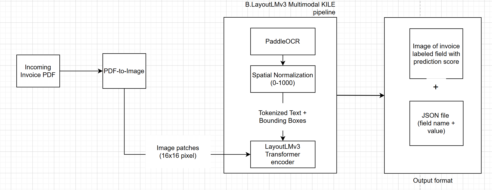

# LayoutLMv3 Invoice Fine-Tuning & Information Extraction

[](https://www.python.org/)
[](https://pytorch.org/)
[](https://huggingface.co/)
[](https://github.com/PaddlePaddle/PaddleOCR)

An end-to-end multimodal deep learning pipeline for **Key Information Extraction (KIE)** from complex semi-structured invoice documents. This repository integrates **LayoutLMv3** with **PaddleOCR** line-to-word bounding box alignment for field extraction across 24 invoice entity categories (49 BIO tags).

---

## 📐 System Architecture

LayoutLMv3 fuses three distinct modalities to understand semi-structured document layouts:



### Multimodal Fusion Mechanism
1. **Vision Modality**: Document images are sliced into $16 \times 16$ visual patches and embedded via a Vision Transformer (ViT) backbone.
2. **Text Modality**: High-precision text tokens extracted via PaddleOCR DBNet + CRNN engine, tokenized using Byte-Pair Encoding (BPE).
3. **Layout Modality**: Spatial coordinates $[x_1, y_1, x_2, y_2]$ normalized to a $1000 \times 1000$ coordinate grid to embed 2D spatial relationships.

---

## 📊 Evaluation Metrics & Benchmarks

Evaluated on the 10-document benchmark test set (`set_eval`) under spatial overlap IoU threshold $> 0.60$ and confidence threshold $> 0.40$:

| Metric Category | Metric | Score |
| :--- | :--- | :---: |
| **Spatial Alignment** | Bounding Box Precision | **90.20%** |
| **Spatial Alignment** | Bounding Box Recall | **77.34%** |
| **Spatial Alignment** | **Bounding Box F1-Score** | **83.27%** |
| **Information Extraction** | **Text Extraction F1-Score** | **78.95%** |

---

## 📁 Repository Structure

```text
Invoice-LayoutLMv3-Finetuning/
├── README.md                           <-- Project Overview & Quickstart Guide
├── .gitignore                          <-- Excludes large model weights (*.bin)
├── docs/                               <-- Diagrams and architecture guides
│   └── LayoutLMv3_structure.png
├── Finetuning/                         <-- Training engine & standalone inference
│   ├── src/                            <-- Engine, DataLoader, Trainer, Model modules
│   ├── inputs/                         <-- Input configs and training JSONs
│   ├── inference_script.py             <-- Standalone batch inference script
│   └── requirements.txt
├── Preparing data-finetuned/           <-- Dataset preparation pipeline
│   ├── generate_ner_tags.py            <-- IoA bounding box tagger & BIO tag generator
│   ├── combine_dataset.py              <-- Consolidates document JSONs for training
│   ├── analyze_distribution.py        <-- Class balance & label frequency analyzer
│   ├── Labels.txt                      <-- Target 24 invoice field schema
│   └── label_config.json               <-- 49 BIO class mapping dictionary
├── notebooks/                          <-- Jupyter Notebooks
│   ├── Demo_Inference.ipynb            <-- Interactive pipeline demo & metrics visualization
│   └── Finetune_Colab.ipynb            <-- Google Colab GPU training notebook
└── set_eval/                           <-- 10 sample evaluation PDF invoices
```

---

## 🚀 Quickstart Guide

### 1. Environment Setup

Clone the repository and install the dependencies:

```bash
git clone https://github.com/khoinopro/Invoice-LayoutLMv3-Finetuning.git
cd Invoice-LayoutLMv3-Finetuning

# Install requirements
pip install -r Finetuning/requirements.txt
```

---

### 2. Data Preparation Pipeline

To prepare a new dataset for LayoutLMv3 training:

1. Place raw OCR JSONs in `Preparing data-finetuned/ocr_without_ner_tags/` and ground truth annotations in `Preparing data-finetuned/annotations/`.
2. Generate BIO tags using Intersection-over-Area (IoA) bounding box matching:
   ```bash
   python "Preparing data-finetuned/generate_ner_tags.py"
   ```
3. Consolidate document annotations into the master dataset JSON:
   ```bash
   python "Preparing data-finetuned/combine_dataset.py"
   ```
4. Verify label distributions:
   ```bash
   python "Preparing data-finetuned/analyze_distribution.py"
   ```

---

### 3. Model Fine-Tuning

To initiate fine-tuning on GPU:

```bash
python Finetuning/src/main.py
```

* The training module runs with accumulation steps, saving best validation checkpoints as `model.bin`.
* Alternatively, run **`notebooks/Finetune_Colab.ipynb`** directly on Google Colab GPU runtime.

---

### 4. Running Inference & Evaluation

#### Interactive Demo Notebook
Launch `notebooks/Demo_Inference.ipynb` in Jupyter Lab to run visual inference on `set_eval` PDFs and render bounding box overlays.

#### Batch Production Inference
To process a folder of invoice PDFs in batch mode:
```bash
python Finetuning/inference_script.py --pdf_dir set_eval/ --output_dir outputs/
```

---

## 🏷️ Extracted Invoice Entities (24 Categories)

| Entity Type | Label Fields |
| :--- | :--- |
| **Document Metadata** | `document_id`, `date_issue`, `date_due`, `terms`, `purchase_order_id` |
| **Vendor / Sender** | `sender_name`, `sender_address`, `sender_vat_id`, `vendor_phone` |
| **Customer / Recipient** | `recipient_name`, `recipient_address`, `recipient_delivery_name`, `recipient_delivery_address` |
| **Tax & Totals** | `amount_due`, `amount_total_base`, `amount_total_tax`, `tax_amount`, `tax_name` |
| **Line Items** | `item_description`, `item_amount`, `item_amount_total`, `item_uom` |

---

## 📄 License
This project is developed for Invoice Key Information Extraction research and production fine-tuning.
